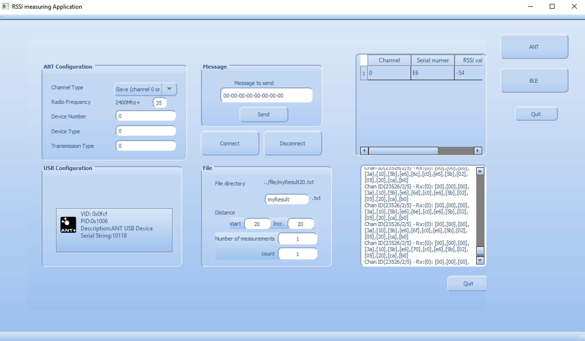

# RF Technologies for Indoor Localization and Positioning (2018)

# Overview
Firmwares and a GUI software designed for comparing RF technologies (BLE and ANT) for indoor localization.

# Prerequisites
-   [D52QM6 SoC modules](https://www.thisisant.com/developer/components/d52)
-   [nRF52 DK](https://www.nordicsemi.com/Software-and-tools/Development-Kits/nRF52-DK/Getting-Started)

-   [Qt](https://www.qt.io)
-   [SEGGER J-Link](https://www.segger.com/downloads/jlink/) 
-   [Keil MDK (nRF_DeviceFamily)](https://developer.nordicsemi.com/nRF5_SDK/pieces/nRF_DeviceFamilyPack/)

# Installation

`git clone https://github.com/xuanjiao/ANT_BLE_localization.git`

# Usage

## Peer-to-peer communication
The picture below is a Peer-to-peer setup. It contains three parts.
-   A beacon (D52QM6 SoC) periodically sends messages. 
-   A base station (nRF52 DK) connected to a laptop via USB. It measures the RSSI values.
-   A laptop which run the GUI software. It can not only configure the communication setting of the base station, but also receive values and store them. 

To reduce the experimental variates, it is recommanded to perform the experiment in a large empty lab space without obstacles. 

## ANT multi-channel communication
In the multi-channel solution, multiple beacons broadcast with different radio frequency. The base station establishes multiple channels to listen to those beacons simultaneously. 

## Fingleprinting localization
The fingleprint localization is mainly divided into two phases:
-   Offline training phase: Gather RSSI values at known locations and establish a fingleprint database for mapping of RSSI and sampling positions.
-   Online localization phase: Measure the RSSI value of multiple beacons and find the matching position in the fingleprint database.

We implemented a simple fingerprint-based localization senario and evaluated the performace of BLE and ANT. The experiment results suggest that ANT-based-fingleprinting-localization can clearly outperform BLE. For more details please refer to the poster abstract [PDF](Doc/ANT_Poster.pdf)
or [ACM_digital_library](https://dl.acm.org/doi/10.1145/3274783.3275217)

# Window and dialog widgets

### Main window
The user can click the ''ANT'' bottum to enter the ANT widget or click the ''BLE'' bottum to enter the BLE widget.

### ANT widget
Firstly the user should connect the nRF52 DK to the laptop via USB. Secondly, the user can configure the file setting and serial port setting and click ''Connect'' bottom. Then the device details will be shown in the left text view. Once the base station find the broadcasting beacon, the received messages will be printed on the right text view and the RSSI values will be printed on the table view. Also, the user can send an eight-byte ANT messages to beacons. 

### BLE widget
Similar to ANT widget, the user should firstly connect the nRF52 DK to the laptop via USB. Secondly, the user can enter the file name and choose a serial port and then click ''Connect'' bottom. The measured RSSI values will be printed on the text view.
